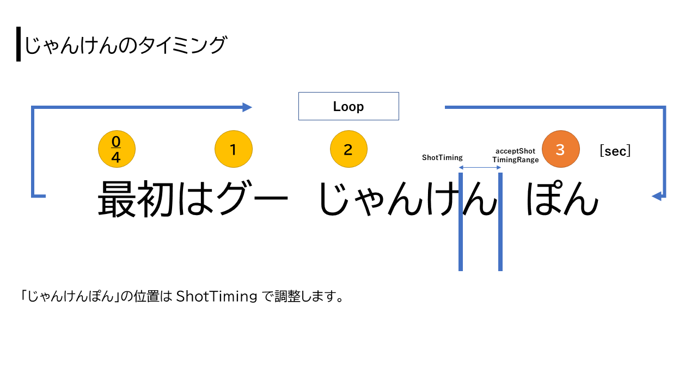
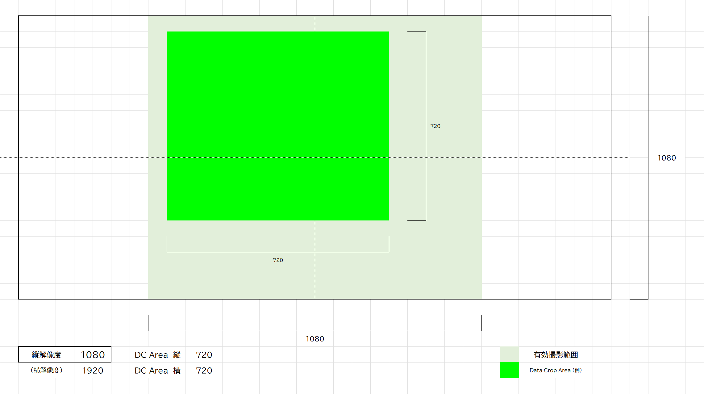

# jyanken-shot > Shot

おまえのじゃんけんを撮らせろ



## Shot images

```python
# Main Variable
CaptureDeviceID = 0
CaptureResolution = (1920, 1080, 15)  # Width, Height, fps
CroppingSize = 720
OutputResolution = 64

ShotTiming = 3.5
acceptShotTimingRange = 0.2
```

## Data Crop による Augmentation

```python
import main
main.ImageCrop()
```


